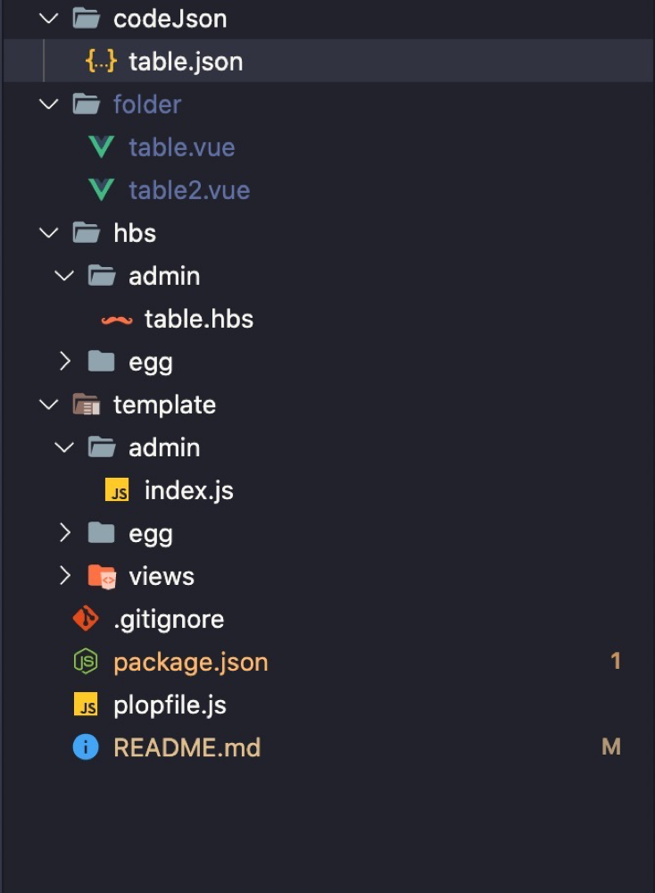

> 在开发后台管理过程中,无论我们添加页面也好还是添加组建也好。都需要不停地新建 vue 文件(或者其他框架、或者 html/js/css 文件),这些都是大量枯燥无味、浪费大量时间的重复工作。尤其是在后台管理开发的过程中，其实每个模块的结构骨架都非常相似，可以使用`plop`来实现自动化构建。生成模版之后，只需要更改其中的一些参数即可。

<!-- more -->

#### 一、安装 plop

在项目的根目录下面使用 ynpm 命令安装 plop[传送门](https://github.com/plopjs/plop)：
`npm install --save-dev plop`

#### 目录文件结构



#### 二、编写 plop 的入口文件

在项目的根目录下面新建文件：`plopfile.js`

> 然后我们通过 plop 对象，创建生成器任务,然后在根目录问价下创建 plop 的生成器方法。通过 prompts 获取相关数据

```javascript
// plopfile.js
module.exports = function (plop) {
  // 如果有多种生成方法可以继续往下添加
  plop.setGenerator('table', require('./template/admin/table.js'));
};
```

#### 三、编写生成文件命令

> 主要是通过 plop 对象里面的`prompts`函数获取用户输入的变量值，然后通过`actions`进行执行生成文件。

```javascript
// template/admin/table.js
module.exports = {
  description: '基于element-ui的vue生成器',
  prompts: [
    {
      type: 'input',
      name: 'name',
      message: '请输入文件名字：',
      default: 'table',
    },
    {
      type: 'input',
      name: 'jsonName',
      message: '请输入codeJson下的文件',
      default: 'table',
    },
  ],
  actions: function (data) {
    const table = require(`../../codeJson/${data.jsonName}.json`);
    var actions = [];
    actions.push({
      type: 'add',
      path: `folder/${data.name}.vue`,
      templateFile: 'hbs/admin/table.hbs',
      data: {
        name: data.name,
        table,
      },
    });
    return actions;
  },
};
// codeJson模版，可根据需求自定义各种属性。
{
    "list":[
        {
            "field":"name", //字段属性
            "fieldName":"姓名", // 字段名称
        },
        {
            "field":"sex",
            "fieldName":"性别"
        }
    ]
}
```

> hbs/admin/table.hbs 文件内容 [文档地址](https://handlebarsjs.com/guide/builtin-helpers.html#if)

```hbs
<template>
  <el-table :data="tableData" style="width: 100%" max-height="250">
    {{#each table.list}}
    <el-table-column prop="{{fieldName}}" label="{{field}}">
    </el-table-column>
    {{/each}}
    <el-table-column fixed="right" label="操作" width="120">
      <template slot-scope="scope">
        <el-button @click.native.prevent="deleteRow(scope.$index, tableData)" type="text" size="small">删除</el-button>
      </template>
    </el-table-column>
  </el-table>
</template>

<script>
export default {
  name: '{{ properCase name }}',
  methods: {
    deleteRow(index, rows) {
      rows.splice(index, 1);
    },
  },
  data() {
    return {
      tableData: [],
    };
  },
};
</script>
```
